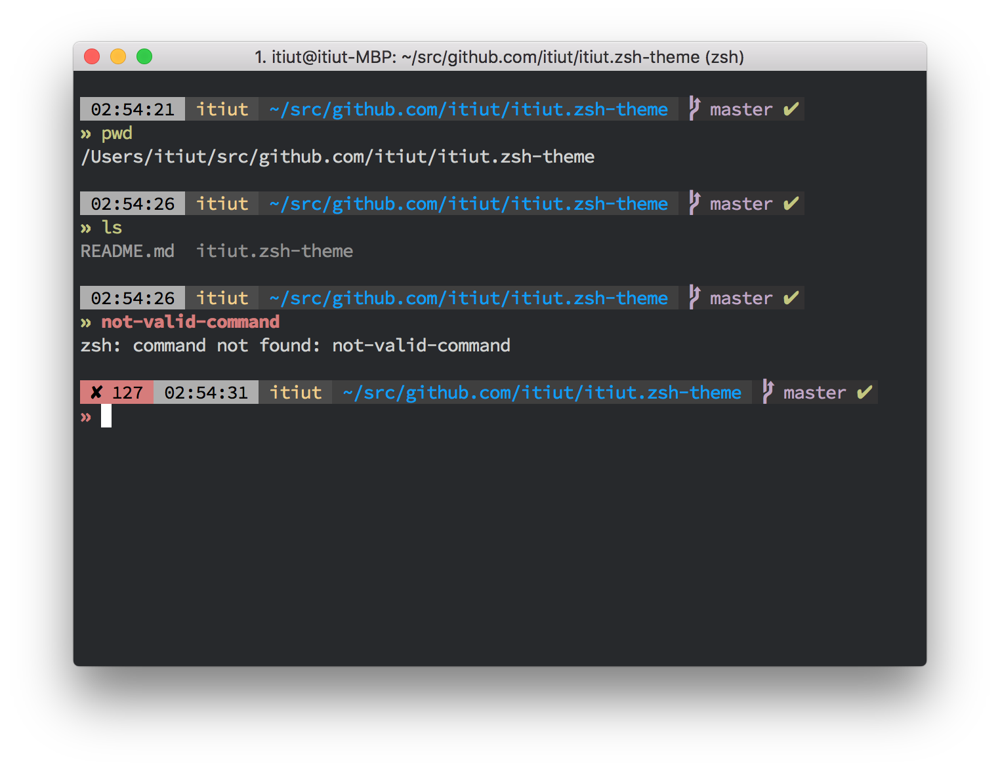

hanpen.zsh-theme
====

> :art: Hanpen Zsh theme

Dependencies
----

-   [oh-my-zsh](https://github.com/robbyrussell/oh-my-zsh)

Features
----

-   Show git branch and status.
-   Show exit status except for 0 (success).
-   Show command execution time longer than `ZSH_THEME_HANPEN_CMD_MAX_EXEC_TIME` (default: `5`) seconds.
-   Colorize less(1) in man pages and with GNU Source-highlight.

Recommended usage
----

-   Use powerline-patched fonts.
-   Locate a theme for GNU dircolors on `~/.dircolors` or assign the path to `ZSH_THEME_HANPEN_DIRCOLORS_THEME_PATH` variable.
-   Install GNU Source-highlight `src-hilite-lesspipe.sh` into a directory in `$PATH`.
-   Install [sindresorhus/pretty-time-zsh](https://github.com/sindresorhus/pretty-time-zsh).

Others
----

In the screenshot, followings are used:

-   [zsh-syntax-highlighting](https://github.com/zsh-users/zsh-syntax-highlighting)
-   Tomorrow Night in [iTerm2-Color-Schemes](https://github.com/mbadolato/iTerm2-Color-Schemes)
-   `dircolors.256dark` in [dircolors-solarized](https://github.com/seebi/dircolors-solarized)
-   [Source Code Pro](https://github.com/adobe-fonts/source-code-pro)
